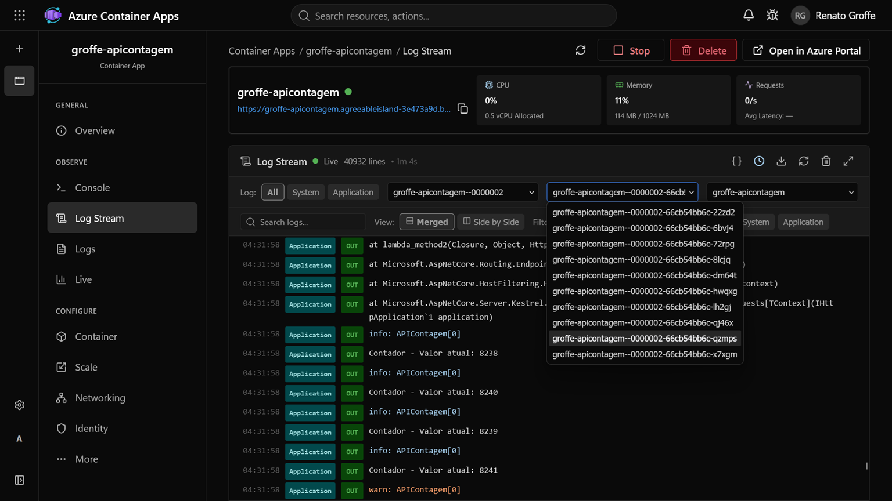
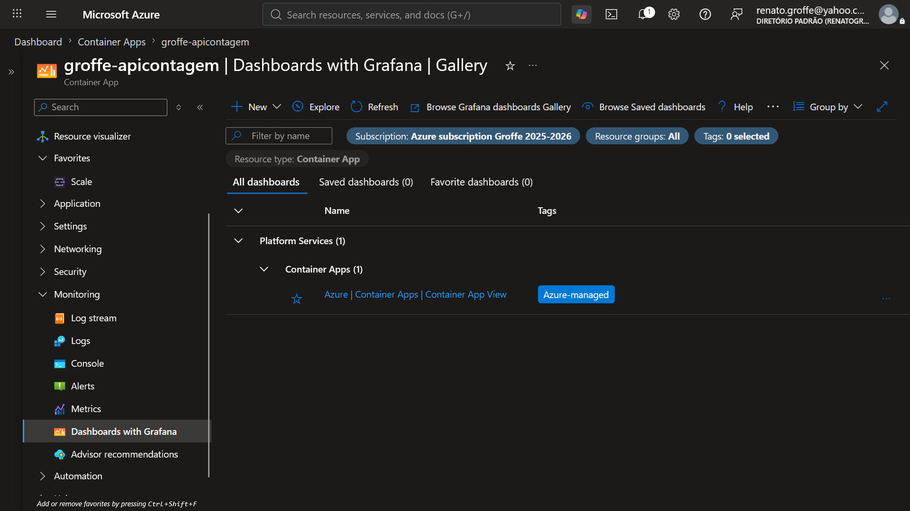
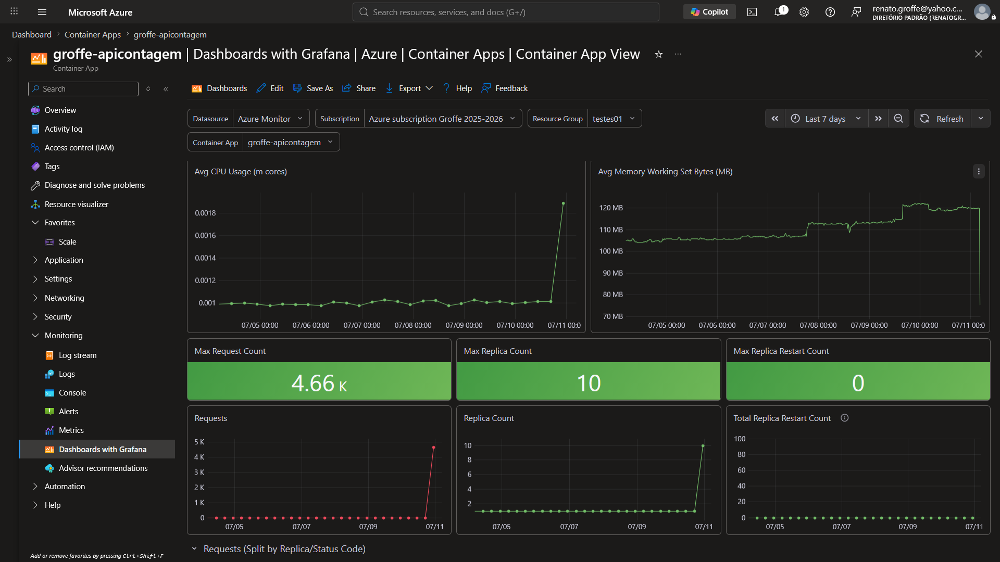

# azure-container-apps_2026-07
Alguns conteúdos envolvendo novidades ao trabalhar com Azure Container App (Julho-2026).

Novo Portal do Azure Container Apps: **https://containerapps.azure.com/login**

Um pouco mais sobre o Azure Contaer Express: **https://techcommunity.microsoft.com/blog/appsonazureblog/introducing-azure-container-apps-express/4519150**

## Testes

Imagem (**docker.io**):

```
renatogroffe/aspnetcore10-apicontagem-simulacaofalhas:1
```

Environment Variables:

| Variável | Valor |
|---------|-------|
| `ConnectionStrings__ApplicationInsights` | String de Conexão do Application Insights |
| `SimularFalhas` | `true` \| `false` |

Logs em tempo real no portal do Azure Container Apps:



Dashboards with Grafana:



Resultados em dashboard do Grafana:


